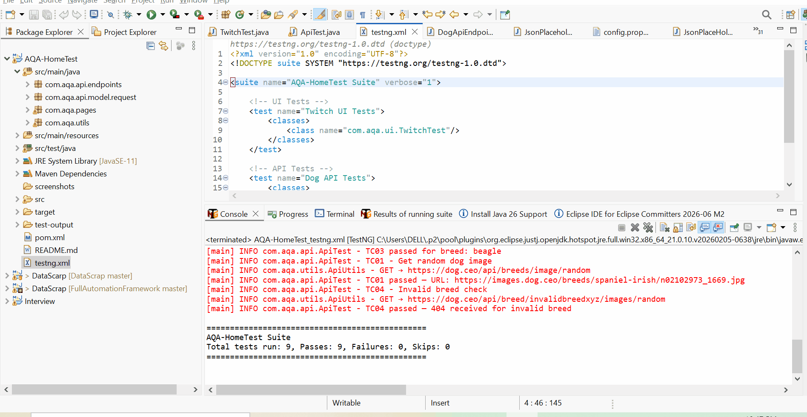

# AQA Home Test — Java + Selenium + REST Assured

## Test Demo



## Tech Stack

| Area | Tool |
|---|---|
| Language | Java 11 |
| UI Automation | Selenium 4 |
| API Automation | REST Assured 5 |
| Test Runner | TestNG 7 |
| Build Tool | Maven |
| Driver Management | WebDriverManager |

---

## Project Structure

```
AQA-HomeTest/
├── src/
│   ├── main/java/com/aqa/
│   │   ├── pages/
│   │   │   ├── BasePage.java         ← Reusable Selenium methods
│   │   │   └── TwitchPage.java       ← Page Object for Twitch
│   │   └── utils/
│   │       ├── DriverManager.java    ← Chrome Mobile Emulation setup
│   │       └── ScreenshotUtil.java   ← Screenshot capture
│   └── test/java/com/aqa/
│       ├── base/
│       │   └── BaseTest.java         ← @BeforeMethod/@AfterMethod
│       ├── ui/
│       │   └── TwitchTest.java       ← UI Test Case
│       └── api/
│           └── ApiTest.java          ← API Test Cases
├── screenshots/                      ← Auto-created at runtime
├── testng.xml                        ← Test suite config
├── pom.xml
└── README.md
```

---

## Part A — UI Test: Twitch StarCraft II Search

### Test Steps

| Step | Description |
|---|---|
| 1 | Navigate to https://www.twitch.tv |
| 2 | Click the Search icon |
| 3 | Type "StarCraft II" |
| 4 | Scroll down 2 times |
| 5 | Select first available streamer |
| 6 | Handle any modal/popup (age gate, consent) |
| 7 | Wait for video player to load |
| 8 | Take a screenshot |

### Mobile Emulation
Tests run using Chrome's **iPhone X** mobile emulator via `ChromeOptions`:
```java
mobileEmulation.put("deviceName", "iPhone X");
options.setExperimentalOption("mobileEmulation", mobileEmulation);
```

---

## Part B — API Tests: Dog CEO API

Base URL: `https://dog.ceo/api`

### Test Cases

| TC | Endpoint | Validation | Why |
|---|---|---|---|
| TC01 | `GET /breeds/image/random` | Status 200, URL contains `.jpg/.png` | Confirms basic API health and response format |
| TC02 | `GET /breeds/list/all` | Status 200, breeds map non-empty, known breed present | Validates data completeness |
| TC03 | `GET /breed/{breed}/images/random` (x3 breeds) | Status 200, URL contains breed name | Parametrized — covers multiple breeds with minimal code |
| TC04 | `GET /breed/invalidbreedxyz/images/random` | Status 404, error message present | Validates error handling for bad input |

### Why these validations?
- **Status codes** confirm HTTP contract is correct
- **Response body fields** (`status`, `message`) validate API contract
- **URL pattern matching** ensures correct data is returned per breed
- **Negative test (TC04)** confirms proper error handling — critical for reliability

---

## How to Run

### Prerequisites
- Java 11+
- Maven 3.6+
- Google Chrome installed

### Run all tests
```bash
mvn clean test
```

### Run only UI tests
```bash
mvn test -Dgroups=ui
```

### Run only API tests
```bash
mvn test -Dgroups=api
```

### Screenshots
Saved automatically to `/screenshots/` folder after UI test run.

---

> 🎥 GIF showing test run — add after recording locally with a screen recorder
